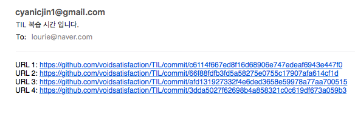

# Repo watcher

- Regular alarm of updating certain github repository.
- Alarm time is configuable.
- Use gmail smtp server(own gmail account)

Informed e-mail is like this:



## Purpose

My main purpose to make this repository is for reviewing my github repository. I have an individual study diary which is about "every day learning about conputer science" on Github.

I just realized that writing down my learning on github is really helpful way to memorize my knowledge, but I also thought I wish I have some kinds of reviewing tools for my written material.

Therefore I made this application.

Not only my own purpose, Others also can customize or make use of this system as you wish.

## Usage

### 1. change config_not_changed.json

At first, you can see below:

```json
{
  "mail": {
    "from": "INPUT_YOUR_EMAIL_ADDRESS",
    "to": [
      "INPUT_RECEIVER_EMIL_ADDRESS"
    ],
    "username": "INPUT_YOUR_USER_NAME",
    "password": "INPUT_YOUR_GMAIL_PASSWORD"
  },
  "github": {
    "owner": "INPUT_OWNER",
    "repository": "INPUT_YOUR_REPOSITORY"
  },
  "alarmTime": ["19:00", "22:00", "23:00"]
}

```

Please change file name from `config_not_changed.json` to `config.json`

and configure the content as you wish. Such as:

```json
{
  "mail": {
    "from": "your_gmail@gmail.com",
    "to": [
      "target_mail_account@example.com"
    ],
    "username": "your_gmail@gmail.com",
    "password": "your_gmail_password",
  },
  "github": {
    "owner": "voidsatisfaction",
    "repository": "TIL"
  },
  "alarmTime": ["19:00", "22:55", "1:02", "0:00"]
}
```

### 2. cd to src

change working directory to `Repo-watcher/src/`

### 3. execute go program

`go run main.go`

## Developement

1. Install Docker
2. cd to `Repo-watcher`(the place having Dockerfile)
3. docker build --tag repo-watcher:0.1 .
4. docker run -d -v $PWD:/go/src/Repo-watcher --name repo-watcher repo-watcher:0.1
5. docker logs repo-watcher
6. if there is `worked` sign, then it is actually working!

After register docker container, you can freely change `alarmTime` on `config.json` no matter where, at both local and container. Because, these two folder is connected with `-v` option when we run the image.

## TODO

- [ ] Add Unit Test
- [ ] Refactor More readable code
- [ ] Seperate Timer, Mailer, Watcher, Template
- [ ] Enable customize github owner and repository
- [ ] Add Weekly alarm time
- [ ] Email template
